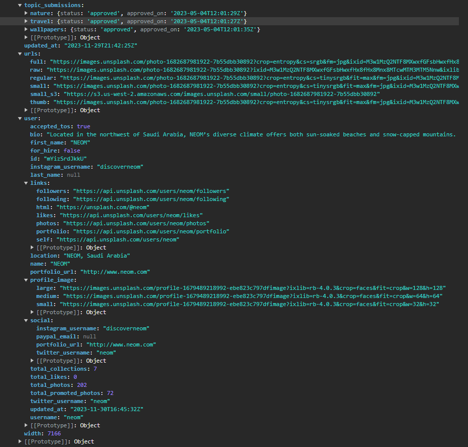

# Documentación del proyecto

Imágenes usadas -> ./assets

## HTML

## CSS

El CSS se ha dividido en diferentes partes:

- ./styles.css

  - Fuentes importadas desde Google Fonts
  - Estilos generales (variables de CSS)
  - Estilos que se apliquen a todos los elementos, así como a la etiqueta HTML

- ./src/components/nav/nav.css

  - Estilos de la barra de navegación

- ./src/components/nav/body-main.css
  - Los estilos del main dentro del body
    - Estilos del timeline de imágenes
    - Estilos del show more

## JS

- ./main.js

  - Imports específicos de cada sección, tanto CSS como JS

## API

