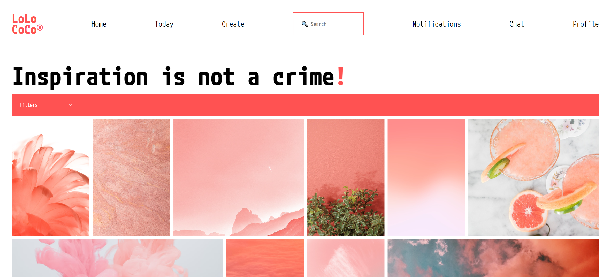

# LoLoCoCo® 

## Hi! 👋🏼 Thanks for checking this project!

This is an image filter page connected to Unsplash API using async JS, inspired in Pinterest.

This project was created in order to practice async functions and secondary functions like animations.

Still in development.

Technologies used:

### See it deployed: https://lolococo.netlify.app/

